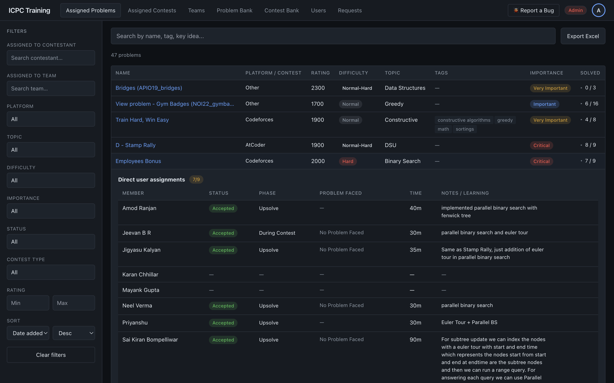
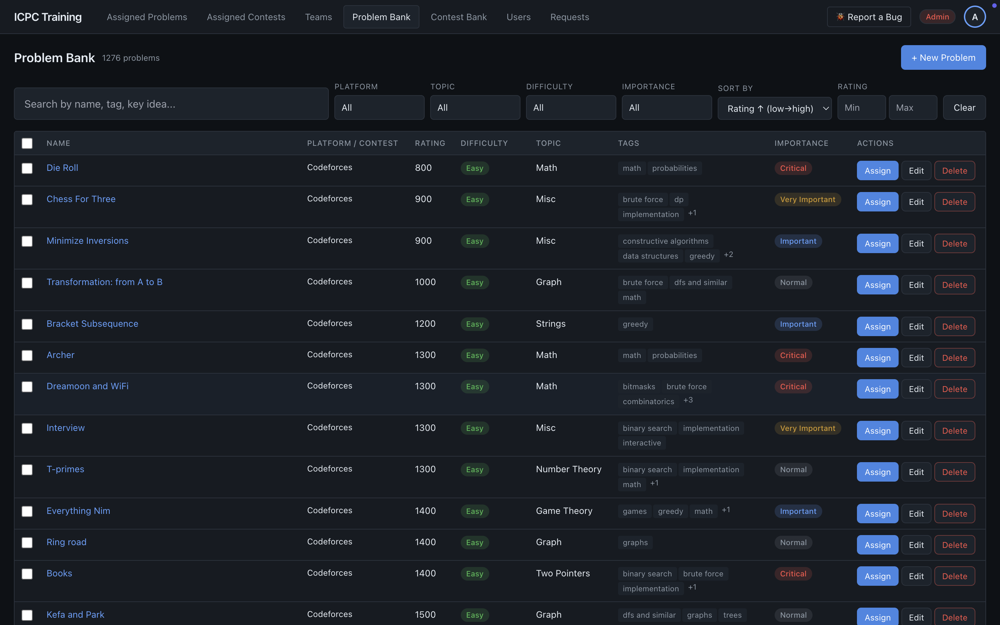
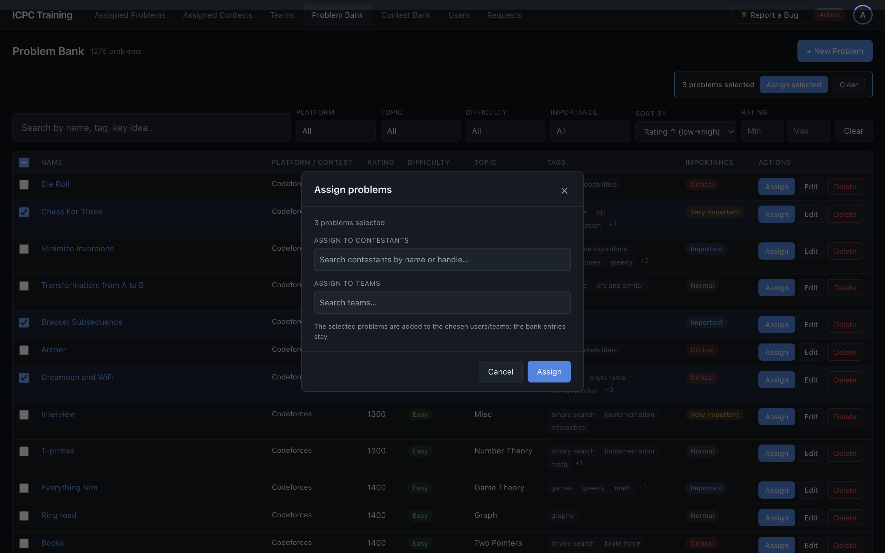
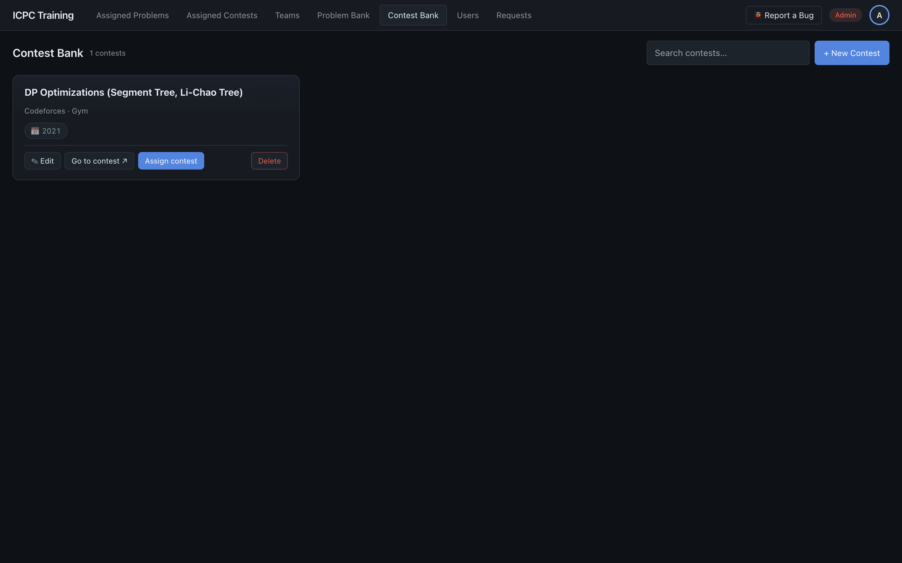
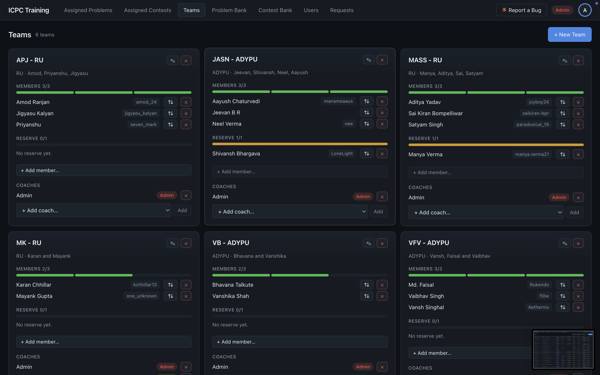
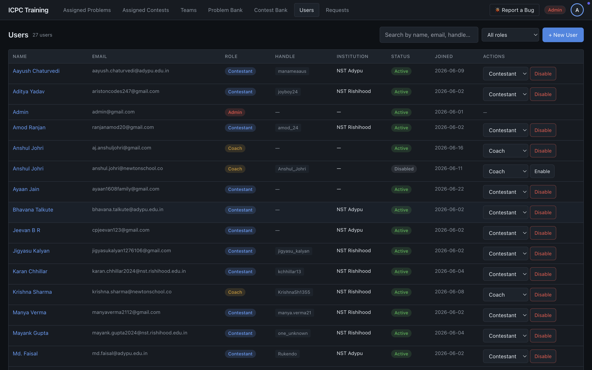
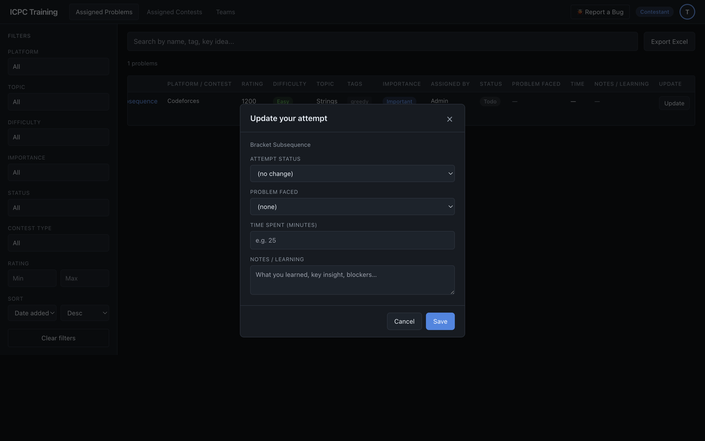
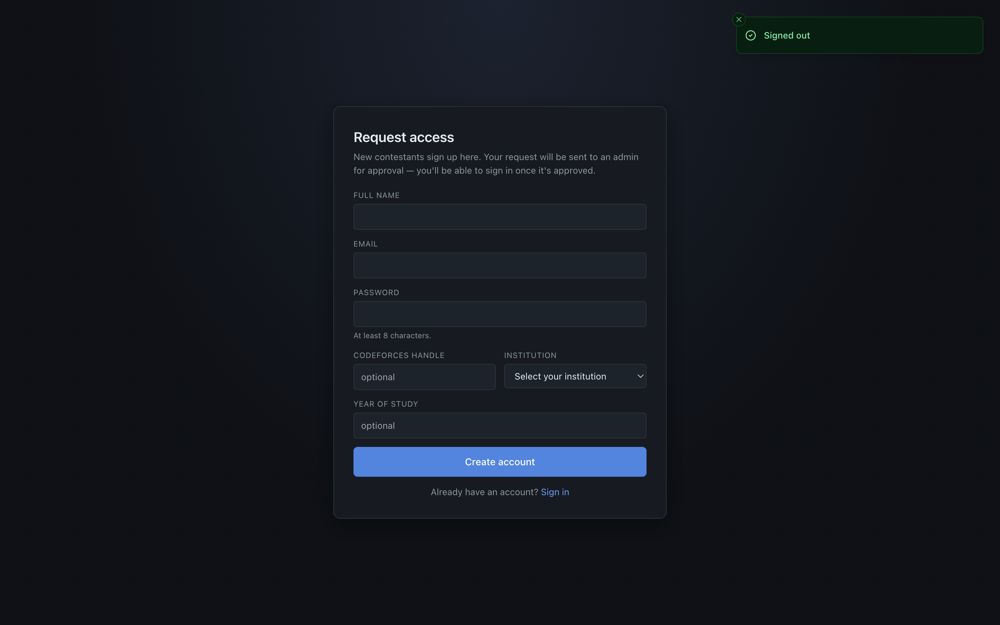

# ICPC Training Platform

A full-stack web application for managing competitive-programming training for ICPC teams. Coaches and admins curate a bank of **1,200+ problems** and past **contests**, assign them to teams or individual contestants, and track every member's progress, attempts, and post-contest reflections — all behind role-based access control.

**Stack:** React 19 + TypeScript + Vite (frontend) · FastAPI + Pydantic v2 (backend) · PostgreSQL / Supabase · deployed on Render.

> The previous SQLite + Flask + vanilla-HTML prototype lives in [`legacy/`](legacy/); the current app is a ground-up rewrite into a typed React SPA and an async FastAPI service.

---

## Highlights

- **Role-based access control** — three roles (Admin, Coach, Contestant) with permissions enforced server-side on every endpoint (e.g. a coach can only assign to teams they coach; contestants only see what's assigned to them).
- **Problem Bank** — 1,200+ problems with rich metadata (platform, contest, rating, difficulty, topic, tags, importance), full-text search, multi-select faceted filters, sorting, single & **bulk assignment**, and one-click **Excel export**.
- **Contest Bank** — curate past contests with a star difficulty rating (1–10), length, and platform; assign a whole contest to teams with an optional **due date**.
- **Assignment tracking** — contestants log per-problem attempts (status, time spent, problem faced, notes); coaches/admins get an aggregated **per-team / per-member breakdown** in an expandable view.
- **Contest reflections** — after a contest, each member records their status, number of problems solved, how it went, and mistakes made; the whole team and their coaches can learn from each other's write-ups.
- **Teams** — team builder with member/reserve slots, coach assignment, and capacity visualisation.
- **Self-service onboarding** — contestants request access; admins approve via a Requests queue.
- **Performance-conscious data layer** — list endpoints batch their hydration to avoid N+1 queries (counts, assignees, and phase roll-ups resolved in a constant number of queries regardless of page size).
- **Versioned SQL migrations** — a small migration runner applies ordered, tracked, transactional `.sql` migrations.

---

## Screenshots

### Assigned Problems — coach/admin view with per-team breakdown
Aggregated solved counts per problem; expand a row to see each team and member's status, phase, time, and notes.



### Problem Bank — search, faceted filters, and assignment


### Bulk assignment
Select multiple problems and assign them to contestants and/or teams in one action.



### Contest Bank
Curate past contests; assign a whole contest to teams with an optional due date.



### Teams
Member/reserve slots, capacity bars, and coach management.



### Users & roles (admin)


### Contestant — log an attempt


### Self-service sign up (admin approval required)


---

## Architecture

```
ICPC-Training/
├── web/                      # React 19 + TypeScript + Vite SPA
│   └── src/
│       ├── pages/            # route screens (Problems, Contests, Teams, Users, Bank, …)
│       ├── components/       # feature + shared UI (Radix primitives, Tailwind)
│       ├── services/         # typed API client wrappers
│       ├── contexts/         # auth/session context
│       ├── hooks/            # data-fetching hooks
│       └── types/            # shared TypeScript models
│
├── backend/                  # FastAPI service
│   ├── app/
│   │   ├── routers/          # HTTP endpoints (auth, users, teams, problems, bank, contests, …)
│   │   ├── repositories/     # SQL data-access layer (async psycopg)
│   │   ├── schemas/          # Pydantic request/response models
│   │   ├── deps.py           # auth + role-gating dependencies
│   │   ├── security.py       # session signing, password hashing
│   │   └── main.py           # app wiring + router registration
│   ├── migrations/           # ordered, tracked .sql migrations
│   └── scripts/migrate.py    # migration runner (apply / --check)
│
├── render.yaml               # Render Blueprint (API + static site)
└── legacy/                   # original Flask + SQLite prototype
```

### Tech stack

| Layer | Technology |
|---|---|
| Frontend | React 19, TypeScript, Vite, Tailwind CSS, Radix UI, React Router, React Hook Form, KaTeX/Markdown |
| Backend | Python 3.11, FastAPI, Pydantic v2, async `psycopg` 3, `itsdangerous` (signed sessions), `openpyxl` (XLSX) |
| Database | PostgreSQL (Supabase) |
| Auth | Signed session cookies, PBKDF2 password hashing, role-based gating |
| Deploy | Render (FastAPI web service + static SPA) |

### Engineering notes

- **N+1 prevention:** listing pages hydrate counts, assignees, and per-viewer phase roll-ups in a fixed number of batched queries (`hydrate_many`, `phase_rollup_many`) rather than per-row.
- **Assignment integrity:** problem assignments carry a `via_contest` flag and an upsert policy so a manual assignment always "wins" over a contest-derived one, and re-assigning is idempotent (never wipes existing assignments).
- **Single source of truth for contests:** contests are assigned at the team level (`contest_teams`), with each member's status/reflection stored once per `(contest, user)`.
- **Auditability:** assignments record `assigned_by`, so coaches and admins see who assigned what.

---

## Local development

### Prerequisites
- Python 3.11+
- Node.js 18+
- A PostgreSQL database (local Postgres or a free Supabase project)

### 1. Backend

```bash
cd backend
python3 -m venv .venv
source .venv/bin/activate            # Windows: .venv\Scripts\activate
pip install -e .

# Configure environment (see .env.example at the repo root)
export DATABASE_URL='postgresql://...'
export FLASK_SECRET_KEY="$(python -c 'import secrets; print(secrets.token_hex(32))')"

# Apply migrations
python -m backend.scripts.migrate          # from the repo root
# (check status without applying: python -m backend.scripts.migrate --check)

# Run the API
uvicorn app.main:app --reload --port 8000
```

Interactive API docs are then served at <http://127.0.0.1:8000/docs>.

### 2. Frontend

```bash
cd web
npm install
echo "VITE_API_BASE_URL=http://127.0.0.1:8000" > .env.local
npm run dev
```

Open the URL Vite prints (default <http://127.0.0.1:5173>).

---

## Database & migrations

Schema changes are plain `.sql` files in [`backend/migrations/`](backend/migrations/), applied in lexicographic order and tracked in a `schema_migrations` table. Each migration runs in its own transaction.

```bash
python -m backend.scripts.migrate           # apply all pending
python -m backend.scripts.migrate --check   # show applied vs pending
```

Core tables include `users`, `teams`, `team_members`, `team_coaches`, `problems`, `problem_users` / `problem_teams` (assignments), `problem_attempts`, `contests`, `contest_problems`, `contest_teams`, and `contest_member_entries` (per-member status + reflections).

---

## API overview

Base URL: `/api`. Selected endpoints:

| Area | Examples |
|---|---|
| Auth | `POST /auth/login`, `POST /auth/logout`, `GET /auth/me`, `POST /auth/signup` |
| Problems | `GET /problems`, `POST /problems/{id}/attempts`, `GET /export/xlsx` |
| Problem bank | `GET /bank/problems`, `POST /bank/problems/{id}/assign`, `POST /bank/problems/assign` (bulk) |
| Contests | `GET /bank/contests`, `POST /bank/contests`, `POST /bank/contests/{id}/assign`, `DELETE /bank/contests/{id}/teams/{tid}` |
| Contest tracking | `GET /contests/assigned`, `PUT /contests/{id}/entry`, `GET /contests/{id}/breakdown` |
| Teams / Users | `GET /teams`, `GET /users`, role + membership management |
| Admin | signup approval (Requests), role changes, enable/disable users |

Allowed enum values (platforms, topics, difficulties, etc.) are exposed via `GET /api/meta` so the frontend dropdowns stay in sync with the backend.

---

## Deployment

The repo ships a [Render Blueprint](render.yaml) defining two services:

1. **`icpc-api`** — the FastAPI service. Its start command applies pending migrations, then launches Uvicorn.
2. **`icpc-web`** — the React build served as a static site with SPA fallback routing.

Required environment variables (set in the Render dashboard): `DATABASE_URL`, `FLASK_SECRET_KEY` (fixed — regenerating invalidates all sessions), `CORS_ORIGINS`, and `VITE_API_BASE_URL` (build-time, on the frontend service).

---

## License

See [LICENSE](LICENSE).
